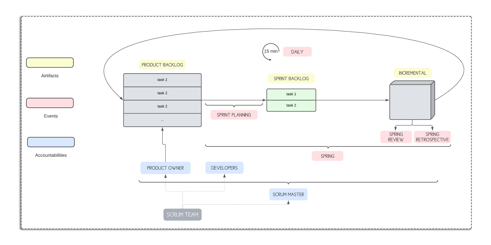
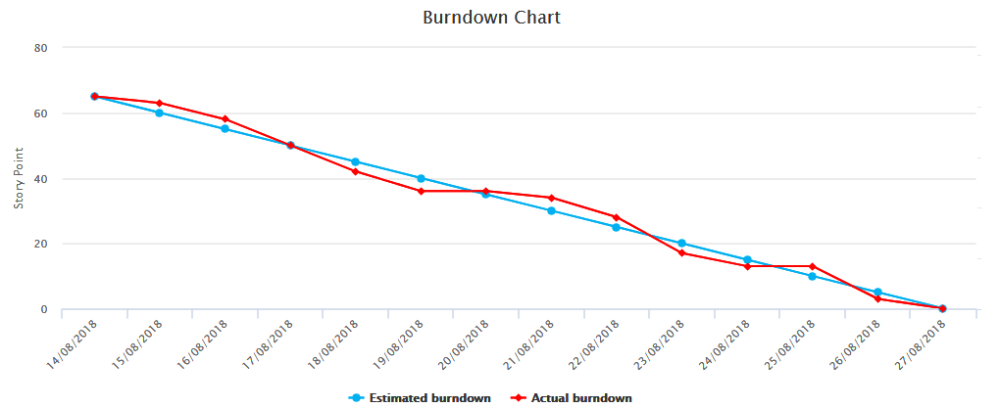

# 📚 Professional Scrum Master 1 (PSM I) cheatsheet.

## **TOC**

  * [**What is SCRUM?**](#--what-is-scrum---)
  * [**Big Picture**](#--big-picture--)
  * [**Scrum Guide**](#--scrum-guide--)
  * [**Agile Manifesto**](#--agile-manifesto--)
    + [Project](#project)
    + [Product](#product)
    + [People](#people)
    + [Process](#process)
  * [**SCRUM Theory**](#--scrum-theory--)
  * [**SCRUM Values**](#--scrum-values--)
  * [**SCRUM Team**](#--scrum-team--)
    + [Product Owner.](#product-owner)
    + [Developers.](#developers)
    + [Scrum Master.](#scrum-master)
  * [**SCRUM Artifacts**](#--scrum-artifacts--)
    + [Product Backlog](#product-backlog)
    + [Sprint Backlog](#sprint-backlog)
    + [Incremental](#incremental)
  * [**SCRUM Events**](#--scrum-events--)
    + [Sprint Planning:](#sprint-planning-)
    + [Sprint](#sprint)
    + [Daily Scrum](#daily-scrum)
    + [Sprint Review](#sprint-review)
    + [Sprint Retrospective](#sprint-retrospective)
  * [**Definitions**](#--terms--)
  * [**HOW TO FACE THE PSM1 ASSESSMENT**](#--how-to-face-the-assesment--)

## **What is SCRUM?**

Scrum is a lightweight framework that helps people, teams and organizations generate value through
adaptive solutions for complex problems.

## **Big Picture**

- **`Artifacts`**: *Product Backlog, Sprint Backlog and Incremental.*
- **`Events`**: ***Sprint**, Sprint planning, Daily, Sprint review and Sprint retrospective*
- **`Accountabilities`**: *Product Owner, Developers and SCRUM Master*

 

## **Scrum Guide**

Scrum Guide as the official standard about Scrum!.

It is recommended reading, it is a very condensed document with all the necessary information to understand SCRUM.

[SCRUM Guide (English)](https://scrumguides.org/scrum-guide.html)

 

## **Agile Manifesto**

Scrum is strongly **based** on `Agile Manifesto`. This is **not mandatory** to pass **PSM1** assessment, but is **good to know**.

We can divide 12 principles of Agile Manifesto in four differents categories:

- Project
- Product
- People
- Proccess

### Project

- *Our highest priority is to satisfy the customer throught early and continuous delivery of **valuable software***
- ***Welcome changing requirements** even late in development. Agile processes harness change for the customer`s ompetitive advantage*
- ***Deliver** working software **frequently**, from a couple of weeks to a couple of months, with a preference to the shorter timescale*
- *Agile processes promote **sustainable development**. The sponsors, developers, and users should be able to maintain a constant pace indefinitely*
- ***Working software** is the primary measure of **progress***

### Product

- ***Simplicity** is essential*
- *Continuous attention to **technical excellence** and good design enchances agility*

### People 

- *The most efficient and effective method of conveying information to and within a development team is **face-to-face conversation***
- ***Bussines** and **developers** must work **together** daily throughout the project*
- *The best archictectures, requirements, and designs emerge from **self-organizing teams***
- *Build projects around **motivated** individuals. **Give** them the environment and **support** they need, and **trust** them to get the job done.*

### Process

- *At **regular intervals**, the team **reflect** on how to become more effective, then tunes and adjusts its behaviour accordingly*

 

## **SCRUM Theory**

> Scrum is founded on **empiricism** and lean thinking. Empiricism asserts that knowledge comes from experience and making decisions based on what is observed. Lean thinking reduces waste and focuses on the essentials.

- `Transparency`: The emergent process and work must be visible to those   performing the work as well as those receiving the work.
- `Inspection`: The Scrum artifacts and the progress toward agreed goals must be inspected frequently and diligently to detect potentially undesirable variances or problems. To help with inspection, Scrum provides cadence in the form of its five events.
- `Adaptation`: A Scrum Team is expected to adapt the moment it learns anything new through inspection.

> **Transparency** enables inspection > **Inspection** enables adaptation > **Adaptation**

 

## **SCRUM Values**

> Successful use of Scrum depends on people becoming more proficient in living five values.

- `Commitment`. 
- `Courage`.
- `Openness`.
- `Focus`.
- `Respect`.

 

## **SCRUM Team**

**`Composed by:`** 
- **Product Owner** (PO) [x1]
- **Scrum Master** (SM) [x1]
-  **Developers** (Devs) [< x10]

> If Scrum Team come large, they should consider reorganizing into multiple cohesive teams, each focused in same Product. **They should share same Product Goal, Product Owner and Product Backlog**

### Product Owner.
- Maximizes the **value** delivery chain.
- Manages the **Product Backlog**.
- The Product Owner represents the interests of the business or community product stakeholders through the content and order of the Product Backlog.
- Customer interaction.
- **Main** responsible for engaging the stakeholders, but not unique. All Scrum team is responsible.
- Progress inspection.
- Product Owner must have **authority**.

### Developers.
- They are responsible for transforming the idea reflected in the **Product Backlog** into **Incrementals**.
- **Self-Managed** and **Cross-Functional**.
- Allowed to update **Product Backlog**, but the PO remains accountable.
- Estimate the **size** of the **Product Backlog**.

### Scrum Master.
- Is responsible to make **Scrum** run smoothly.
- **Accountable** for establishing Scrum.
- Cause the removal of **impediments**.
- **Coaching.**
- **Meeting facilitation.**
- Actions may take in starting up Scrum implementation:
    - Ask the developers to introduce themselves to each others and tell about their skills and background.
    - Ask the PO to explain the product, its bussines need, history, goals...
    - Ask the developers to discuss and identify the way they are going to develop the product.
- **Facilate stakeholders collaboration** as requested or needed.

 

**`Staled Scrum:`**
- Multiple Scrum teams working on **one product.**
- Only **one** Product Owner per Product Goal, so per Product Backlog.
- **One integrated Increment**, so unique Increment.
- Don't need to be synchronized.
- Definition of Done for teams, but every team can have own DOD. Team DOD is a minimum that every team must follow.

 

## **SCRUM Artifacts**

Each artifact contains a commitment:

| Artifact        | Commitment        |
|-----------------|-------------------|
|`Product Backlog`| Product Goal      |
|`Sprint Backlog` | Sprint Goal       |
|`Incremental`    | Definition Of Done|
 

### Product Backlog

- Represent **work-to-do**
- It is **never complete.**
- Commitment: **Product Goal**
    - Is posible to have multiple product goal's, but the Scrum team will **focus** on one product goal at a time.
- The Product Backlog is an **emergent**, ordered list of what is needed to improve the product. 
- It list all features, functions, requirements, enhancements and fixes that constitute the changes to be made to the product in future release.
- It is the **single source of work** undertaken by the Scrum Team. 
- A **Product** has a **single** Product Backlog, no exceptions here.
- Epics -> User Stories.
- Product Backlog **Refinement** required as time is **needed**.
- The **Product Owner** orders it considering whatever he/she judges as appropiate. Order by 4 factors:
    - Size
    - Risk
    - Value
    - Dependences

**`Monitoring progress`**

Three diferents ways proposed by Scrum Guide to control/monitoring the progress:

- `Burn-down chart`: **top-to-bot** with remaining work to do and estimated remaining work to do (like story points) by unit of time (like sprints or days)
    
    

- `Burn-up chart:` **bot-to-top**. Same that burndown chart but with the amount of work done and amount of work to do.

- `Cummulative flow chart.` 

 

### Sprint Backlog

- Represent **work-to-do**

>The Sprint Backlog is composed of the Sprint Goal (why), the set of Product Backlog items selected for the Sprint (what), as well as an actionable plan for delivering the Increment (how).

- By and for the developers. **Only devs can change** the Sprint Backlog.

- **Sprint Goal** is fixed, but **Sprint Backlog** could have changes without change the Sprint Goal.

### Incremental

- Represent **value**
- Each Increment is additive to all prior Increments and thoroughly verified, ensuring that all Increments work together. In order to provide value, the Increment must be usable.
- Work cannot be considered part of an Increment unless it meets the Definition of Done.
    - Definitions Of Done (DOD):
        > A **formal description** of the state of the increment when it meets the **quality** measures required for the product.
    - Each Increment has **only one** DOD.
    - The organization defined DOD, if the organization does not have one, the scrum team must define one appropiated DOD.
- You **dont need** to release Increment at the end of every sprint.
- The Sprint **is not a gate**, release might be performed during a sprint.

 

## **SCRUM Events**

- **`Timmings:`**

    - `Sprint`: No more than **1 month**. 
    - `Sprint planning`: Maximun of **8 hours** for a one-month Sprint.
    - `Daily`: **15 min**.
    - `Sprint Review`: Maximun of **4 hours** for a for a one-month Sprint.
    - `Sprint Retrospective`: Maximun of **3 hours** for a for a one-month Sprint.

- Events are a formal opportunity to inspect and adapt something.

### Sprint Planning:

- `Who`: 
    - Scrum Team.
    - Invited Stakeholders if needed.
- `Topics:`
    - **Why is this Sprint valuable?** *Sprint Goal*
    - **What can be done this sprint?** *Sprint Backlog*
        - **Measure:** Past performance, their upcoming capacity, and their Definition of Done
    - **How will the chosen work get done?** *Increment*

### Sprint

- ***The Heart of Scrum***
- Defined before **Sprint Planning** and cannot be modified later (except when the sprint is cancelled).
- **Must have** fixed durations.
- **During sprint**:
    - No changes are made that would endanger the Sprint Goal.
    - **Quality** goals **no decrease**
    - The Product Backlog is refined if needed.
- **Only** the **Product Owner** has the autority to cancel de Sprint.
- `Invalid Sprints`:
    - Hardening, stabilization sprints..
    - Sprint 0
    - Release Sprint
    - Design Sprint

### Daily Scrum

- Where developers talk about their **progress** toward the **sprint goal** and to **adapt** the **Sprint Backlog** as needed.
- The Scrum Master only needs to ensure that the meeting takes place.
- The **Product Owner** neither participate in the meeting. 
- If **SM** or **PO** participate, they do as **developers**.
- No time to discuss the solution to a problem. Not technical meeting.
- Topics:
    1. Impediments
    2. What work i did yesterday to achieve goal?
    3. What work i am going to do today to achieve goal?

### Sprint Review

- The **Goal** is **inspect** the increment or any other outcome of the Sprint.
- **Adapt** Product Backlog if needed.
- **Undone work** is **NOT** presented during Sprint Review. 
- Sprint Review is based on **transparency** and **colaboration**.

### Sprint Retrospective

- Entire **Scrum Team** participate.
- The purpose of the Sprint Retrospective is to plan ways to **increase quality** and **effectiveness**.
- The Scrum Team inspects how the last Sprint went with regards to individuals, interactions, processes, tools, and their Definition of Done.
- After Sprint Review, and **conclude** the **Sprint**.
- What went/didnt went well during the sprint?
- How we can improve?
- Discuss **DOD**.
- Discuss the **composition** of the team.

## **Terms**

- **`SCRUM`**:
    - *A mechanism to optimize the value delivery system.*
    - *A mechanism to guide changes.*
- **`Effectiveness`**:
    - *Delivering the right product*
- **`Efificiency`**:
    - *Making the team, the people, work as best way*
- **`IKIWISI`**:
    - *I Know It When I See It*
- **`YAGNI`**:
    - *You Ain`t Gonna Need It*
- **`Agility or be agile`**:
    - *Agility means responding to change.*
- **`Definition Of Ready`**:
    - *Set of criteria that defines when a Product Backog item is ready to be execute.*
- **`Bottom-up intelligence`**:
    - **
- **`Product`**:
    - *A product is a vehicle to deliver value. It has a clear boundary, known stakeholders, well-defined users or customers. A product could be a service, a physical product, or something more abstract.*
- **`Product Vision:`**
    - *What drives all the effort to build a product, describint the ultimate reason for creating it*
- **`Product Strategy:`**
    - *Is where we define how to the vision will be realized*
- **`Epics:`**
    - *Short reminders of stuff that the product will have.*
    - *Briefly describe the product features.*
- **`User Stories:`**
    - *To describe small Product Backlog items.*
- **`Story Point:`**
    - *Story points are a unit of measure for expressing an estimate of the overall effort that will be required to fully implement a product backlog item or any other piece of work*
- **`Planning Poker:`**
    - *Is a consensus-based, gamified technique for estimating*
- **`Upcomming Capacity:`**
    - *How many hours available the Developers have for this Sprint*
- **`WIP:`**
    - *Work In Progress.*
- **`Cone of Uncertainty:`**
    - *Describes the reduction of the uncertainty about scope after each iteration.*
- **`Technical debt`:**
    - *Consequences of poor software development practices.*

 

## **HOW TO FACE THE ASSESSMENT**:

In the following `.md` *([how-to-face.md](how-to-face.md))* we will discuss it.